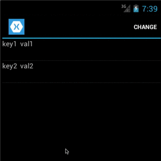

# TestApp
This Xamarin test application shows how to update list view item when item's
properties change. This is achieved by implementing CustomObservableCollection,
which has 'ReportItemChange' method to notify all parties of the change (method
uses Replace event).

# iOS showcase

# Android showcase

